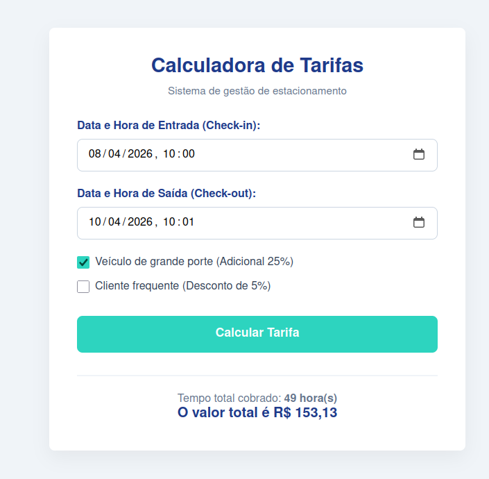

# Estacionamento - Versão 2

Faça uma cópia do exercício do estacionamento (não é para perder o original)

Ajuste o código para que o usuário possa informar:
data e hora de entrada do veículo no estacionamento (checkin) e a data e hora de saída do veículo (checkout)
O sistema deve calcular a quantidade de horas e calcular o valor a ser pago.

Pesquise os recursos necessários para fazer os cálculos com datas e ajuste seu código conforme as novas regras.

Suba sua solução no github numa pasta chamada 2026-04-09 - estacionamento2

Enviar para o github e preencher o formulário

                                               
                                            
 